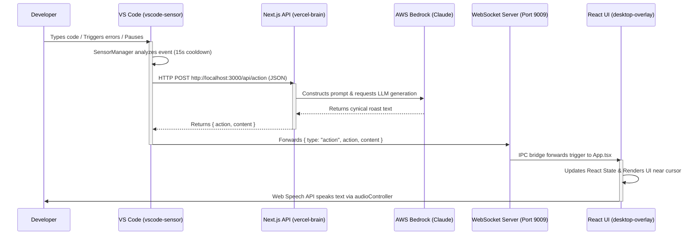

# Anti-Copilot: Full System Architecture & Data Flow

This document provides an exhaustive, granular breakdown of the entire Anti-Copilot project. It is specifically designed to be read by another LLM to immediately understand the project state, data structures, architecture, and behavior.

---

## 1. Full Architecture Diagram



---

## 2. Component Communication & Data Structures

The system communicates across three boundaries:
1. **VS Code ➔ Next.js API**: Standard HTTP POST request.
2. **Next.js API ➔ VS Code**: HTTP JSON response.
3. **VS Code ➔ Electron WebSocket Server**: TCP WebSocket payload.
4. **Electron Main ➔ React UI**: Electron IPC (`webContents.send`).

### Data Passed: VS Code ➔ Next.js API
When a sensor trips, it sends the following JSON payload to `POST /api/action`:
```json
{
  "userId": "system_user",
  "trigger": "pause",
  "timestamp": 1718919293123,
  "context": {
    "errorText": "Cannot read properties of undefined (reading 'map')"
  }
}
```

### Data Passed: Next.js API ➔ VS Code ➔ WebSocket ➔ Overlay
The Vercel Brain returns a specific structure, which is immediately forwarded across the WebSocket verbatim:
```json
{
  "action": "mock",
  "content": "Still trying to map over an undefined variable? Bold strategy."
}
```

---

## 3. How It Behaves (Triggers & State Logic)

The system behavior is governed by strict debounce timers to prevent notification spam.

1. **Global Cooldown (`15000ms`)**: Once any trigger fires, NO other trigger can fire for 15 seconds.
2. **Focus Mode (WPM Tracker)**: Tracks keystrokes in a rolling 60-second window. If WPM >= 40, fires a `focus` trigger ("Light Attack" visual flashbang + Power Rangers quotes).
3. **Pause Detection**: A timer resets on every keypress. If 10 seconds pass without a keypress, a `pause` trigger fires.
4. **Error Tracking**: Reads the active VS Code terminal. If the exact same error is thrown 3 times in a row, a `triple_error` trigger fires (switches VS Code to Light Mode).
5. **Dirty Commit Prevention**: If the user types `git commit` in the terminal while the editor's Diagnostics API reports errors, it fires `dirty_commit` (blocking the screen).

---

## 4. Full Component Breakdown (Directory by Directory)

### A. The VS Code Extension (`/vscode-sensor`)
Native TypeScript extension that monitors the IDE silently.
* **`src/extension.ts`**: The bootstrap file. Initializes the `SensorManager` and connects the `WebSocketClient`.
* **`src/sensors/SensorManager.ts`**: The absolute core of the detection logic. Subscribes to `vscode.workspace.onDidChangeTextDocument` (typing/WPM), `vscode.window.onDidChangeWindowState` (focus), and `vscode.window.onDidWriteTerminalData` (errors). Controls the 15-second debounce loop.
* **`src/sensors/ThemeController.ts`**: Manages punishing the user visually. Contains logic to force VS Code into Light Mode (or rapidly strobe colors for the "Flashbang" effect).
* **`src/transport/WebSocketClient.ts`**: Maintains a resilient `ws://127.0.0.1:9009` connection to the Electron app.

### B. The Next.js API Brain (`/vercel-brain`)
The intelligence layer. Kept separate from Electron to keep the desktop app lightweight.
* **`src/app/api/action/route.ts`**: The single endpoint. 
  * Accepts telemetry payload.
  * Queries AWS DynamoDB for historical context.
  * Prompts AWS Bedrock (Claude 3 Haiku) using a system prompt engineered to produce cynical, mocking developer jokes.
  * Returns the JSON structure. Contains a hardcoded fallback mock object if AWS fails.

### C. The Desktop Overlay (`/desktop-overlay`)
An Electron-Vite-React app that draws a borderless, transparent, click-through canvas over the user's screen.
* **`src/main/main.ts`**: The Master Orchestrator. 
  * Loads environment variables.
  * Automatically spawns the Next.js API process (`npx next dev`).
  * Scans and auto-installs the VS Code extension if missing.
  * Auto-kills orphaned processes on port `3000` (Next.js) and `9009` (WebSocket).
  * Creates the transparent `BrowserWindow`.
* **`src/main/preload.ts`**: Sets up context isolation, creating the `window.antiCopilot` bridge for React.
* **`src/renderer/App.tsx`**: The main UI component. 
  * Listens to `window.antiCopilot.onTrigger`.
  * Renders chat bubbles, floating skulls, or blinding white screens depending on the `action` type.
  * **Text Rendering**: Uses a custom, high-speed typewriter engine that reads the Web Speech API's `onboundary` events to type characters perfectly synchronized with the spoken audio.
* **`src/renderer/audioController.ts`**: Wraps the `window.speechSynthesis` API. Caches the "Google UK English Male" voice, tweaks pitch/rate per emotion (e.g., fast and high-pitched for `flash_light_mode`), and handles overlapping voice cancellation.
* **`src/renderer/styles/global.css`**: Configures the transparent `body` so components anchor near the user's mouse cursor.
